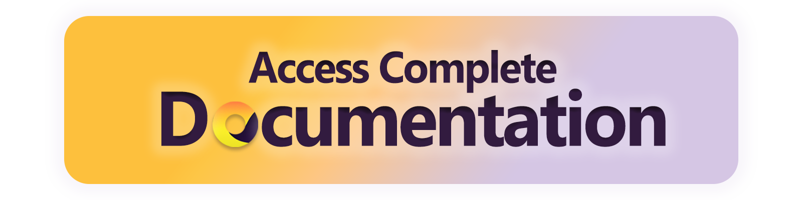

Here's a clean, rephrased, and customized README for your Python-based e-commerce platform named **PAL shop**, written in a clear and simple style:

---

# 🛍️ PAL Shop – E-Commerce Platform


**PAL Shop** is a basic Python-based e-commerce system designed for a single vendor. It provides an easy-to-use interface and includes essential features for managing products, orders, and reports. This is ideal for a local store or anyone looking to run a simple online shop.

---

## ✨ Key Features

* **Product Management**
  Add, edit, and track products, including categories, stock levels, and variations.

* **Order Management**
  Customers can place and track orders, while admins can manage order status and payments.

* **Basic Reporting**
  Get useful insights into sales and store performance.

> ⚠️ This README covers only the initial setup. Full documentation is available [here](https://github.com/Leslie-23/E-Commerce-Platform-master/).

<p align="center">
  <a href="https://github.com/Leslie-23/E-Commerce-Platform-master/" target="_blank">
    
  </a>
</p>

---

## 🚀 Getting Started

### ✅ Requirements

Before you begin, make sure you have:

* MySQL installed and the server running
* Python 3.11 or higher installed

---

### 🛠️ Setup Instructions

1. **Clone the Repository**

   ```bash
   git clone https://github.com/E-com/Leslie-23/e-commerce-Platform-master.git
   ```

2. **Navigate to the Project Folder**

   ```bash
   cd e-commerce-Platform-master
   ```

3. **Install Python Dependencies**

   It's recommended to use a virtual environment.

   ```bash
   pip install -r requirements.txt
   ```

4. **Create the Environment Config File**

   Inside the `dbInitialData` folder, create a file named `.env` and fill it like this (update with your own MySQL credentials):

   ```dotenv
   HOST=localhost
   USER=root
   PASSWORD=your_mysql_password
   DATABASE=ecomdb
   ```

5. **Run the App**

   Start the application using:

   ```bash
   python app.py
   ```

   * If the database doesn’t exist yet, it will be created and filled with sample data.
   * If the database already exists, the app will just start without changing any data.

---

## 📘 About This Project

PAL Shop was built as a university project with a focus on practical database use and a functional UI. It’s a great base if you're learning web apps, databases, or just want to sell your stuff online!

